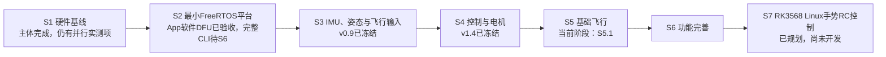

<!--
文件作用：作为 GETFUN F722 V3 FreeRTOS 飞控项目唯一的实时开发进度源，统一记录大阶段、细分里程碑、依赖、完成定义、当前所在位置、已冻结基线和下一开发目标。
覆盖范围：Betaflight硬件基线、FreeRTOS平台、IMU与姿态、CRSF与ADC、控制与电机、基础飞行、功能完善、RK3568 Linux摄像头手势RC控制，以及官方/开源组件的来源决策和登记。
关联文档：项目总纲、01硬件基线、02架构与驱动、03飞行控制与App兼容、04调试记录以及各版本开发计划和验收文档。
维护约束：任何里程碑开始、软件完成、实物验收、冻结标签或目标调整，都必须在同一变更中更新本文；其他文档保留设计细节和验收证据，不再各自维护一份“当前进度”。
-->

# GETFUN F722 V3 项目开发路线与统一进度

> 最后更新：2026-08-13<br>
> 当前主阶段：`S5 基础飞行`<br>
> 当前小目标：`S5.1 首飞前总体验收`<br>
> 当前状态：🟡 S1.10～S1.12与S2.7首飞前恢复关口已关闭，进入首飞前总检查<br>
> 最新冻结基线：`v1.4.1-rom-dfu-recovery-baseline`

## 1. 本文是怎样使用的

本文只负责回答四个问题：

1. 整个项目要经过哪些阶段。
2. 每个阶段还要拆成哪些可开发、可验收、可冻结的小目标。
3. 当前已经完成了什么，项目现在位于哪里。
4. 当前目标完成后，下一步应该做什么。

文档职责分工：

| 文档 | 职责 |
|---|---|
| 本文 `00` | 唯一实时进度、阶段树、依赖、当前目标和维护记录 |
| 项目总纲 | 项目范围、总体架构、安全原则和大阶段定义 |
| `01` | 硬件事实、引脚资源、构建烧录和恢复证据 |
| `02` | FreeRTOS架构、驱动边界、任务和参数系统设计 |
| `03` | 姿态、控制、Mixer、DShot、ARM/Failsafe和App兼容设计 |
| `04` | 调试方法和按日期追加的开发/测试记录 |
| 版本计划文档 | 单个里程碑的固定范围、接口和不包含内容 |
| 版本验收文档 | 构建结果、预期现象、实物步骤和发布结论 |
| Git提交和标签 | 已冻结软件基线的最终证据 |

如果本文与代码、标签或验收事实不一致，应先核对事实，然后立即更新本文。硬件引脚与
电气事实仍以 `01` 为准；本文只引用其确认状态。

## 2. 状态定义与里程碑流程

### 2.1 状态定义

| 标记 | 状态 | 使用条件 |
|---|---|---|
| ✅ | 已验收/已冻结 | 软件检查和必需实物验收通过，已有明确提交或标签 |
| 🔵 | 软件完成，待实物 | 代码与构建已完成，但真实硬件关口尚未通过 |
| 🟡 | 当前目标 | 现在应该设计或开发的唯一主线里程碑 |
| 🟠 | 部分完成/遗留项 | 主体可用，但仍有明确欠项，必须在指定关口前完成 |
| ⬜ | 已规划 | 范围和依赖已知，尚未开始 |
| ⏸ | 条件式/以后决定 | 依赖基础飞行、硬件证据或后续需求，不进入当前排期 |
| ❌ | 阻塞 | 缺少必需证据或外部条件，当前不能继续 |

### 2.2 标准开发流程

每个可冻结里程碑都按以下顺序推进：

```text
确定目标与依赖
  → 调研官方驱动、协议规范和成熟开源候选
  → 冻结实现来源、版本、许可证和项目适配边界
  → 编写/更新开发计划
  → 冻结接口、资源和“不包含内容”
  → 分小步实现并完成中途检查
  → Debug/Release构建和静态检查
  → 编写软件交付与实物验收表
  → 真实硬件验收
  → 更新本文、相关事实文档并激活下一目标
  → Git提交
  → 创建版本标签
```

禁止因为“代码已经写完”直接标记为✅。存在真实硬件行为的目标必须经过实物验收。

### 2.3 实现来源策略

每个里程碑在进入编码前必须从以下策略中明确选择一种，不能等到开发中途再临时决定：

| 策略 | 使用场景 | 项目要求 |
|---|---|---|
| 官方直接集成 | CMSIS、HAL、FreeRTOS、USB等通用基础设施 | 固定仓库内版本，保留许可证，不在生成代码中混入业务逻辑 |
| 官方裁剪适配 | 传感器、存储器等厂商驱动 | 保留来源，在项目接口后使用，只裁剪明确不需要的功能 |
| 开源固定版本引入 | 官方方案不合适且已有成熟轻量实现 | 固定仓库和提交，保存许可证、本地修改和验收记录 |
| 参考成熟实现后复现 | 算法成熟，但现有代码依赖过重或许可证/架构不适合直接引入 | 记录参考来源，按本项目数值、实时性和安全要求重新实现 |
| 完全自主实现 | 项目特有架构或安全核心 | 写清设计依据、失效行为和测试覆盖，不能成为无依据的自创协议 |

默认选择顺序为：官方方案 → 成熟开源方案 → 参考复现 → 完全自主实现。但这不是
机械排序；如果候选方案包含动态内存、不可控阻塞、大量无关依赖、不明确许可证或
不安全的故障行为，必须降级为裁剪适配、参考复现或自主实现。

无论采用哪种策略，模块都必须通过项目自有接口接入。第三方实现可以替换底层，
不能直接决定任务调度、状态发布、ARM/Failsafe或电机安全行为。

## 3. 当前项目坐标



S3已完成并冻结：

```text
S3 IMU、姿态与飞行输入
  ├─ S3.1 ICM42688P轮询基线             ✅ v0.2.0
  ├─ S3.2 SPI DMA与DRDY寄存器门控       ✅ v0.3.0
  ├─ S3.3 陀螺静态零偏校准              ✅ v0.4.0
  ├─ S3.4 加速度校准与参数持久化         ✅ v0.5.0
  ├─ S3.5 IMU低通与精确采样时间         ✅ v0.6.0
  ├─ S3.6 Mahony四元数姿态解算           ✅ v0.7.0
  ├─ S3.7 UART2/CRSF接收与RC快照         ✅ v0.8.0
  ├─ S3.8 RC Failsafe与App Receiver页面   ✅ v0.9.0
  └─ S3.9 ADC3电压/电流与低压状态         ✅ v0.9.0
```

S3.8与S3.9已按文档24通过合并实物验收并冻结为
`v0.9.0-flight-input-baseline`。电源输出使用当前参数110/100/0 mA，开发者确认读数正确，
不再追加标定改动。S4.1、S4.2和S4.3已按文档26通过联合实物验收并冻结为
`v1.0.0-motor-output-baseline`。S4.5～S4.7已按文档32通过拆桨联合实物验收并冻结为
`v1.3.0-flight-safety-baseline`；台架最终确认M1前左、M2后左、M3前右、M4后右，
冻结P-only Profile和保持Throttle的Mixer饱和策略。S4.4、S4.8与S4.9已按文档35通过
App、参数掉电和拆桨联合验收，冻结为`v1.4.0-angle-app-config-baseline`。

```text
S4 控制与电机
  ├─ S4.1 FlightTask与1 kHz安全骨架       ✅ v1.0.0
  ├─ S4.2 DShot600编码与GPIO bitbang       ✅ v1.0.0
  ├─ S4.3 四路无桨测试与250 ms超时归零    ✅ v1.0.0
  ├─ S4.4 RC setpoint、Rates、Expo与模式   ✅ v1.4.0
  ├─ S4.5 Rate PID与抗积分饱和             ✅ v1.3.0
  ├─ S4.6 Quad-X Mixer与输出饱和            ✅ v1.3.0
  ├─ S4.7 ARM/PREARM与统一Failsafe          ✅ v1.3.0
  ├─ S4.8 Angle外环                         ✅ v1.4.0
  └─ S4.9 App配置页面与参数事务             ✅ v1.4.0
```

## 4. 大阶段总览

| 阶段 | 大目标 | 当前状态 | 阶段出口 |
|---|---|---|---|
| S1 硬件基线 | 冻结板卡资源、构建烧录、恢复和实物映射 | 🟠 主体完成，剩余项目按依赖并行补齐 | 所有将被自研固件使用的外设在进入对应软件验收前已有真实硬件证据 |
| S2 最小FreeRTOS平台 | 建立安全启动、RTOS、日志、USB/MSP和恢复能力 | 🟠 App软件DFU已验收；完整CLI留待S6 | 固件可稳定启动、诊断、连接App，并能通过软件命令或硬件BOOT安全恢复 |
| S3 IMU、姿态与飞行输入 | 建立校准IMU、姿态、CRSF、Failsafe和电池数据 | ✅ `v0.9.0`已冻结 | App三维姿态正确、RC通道正常、断线可识别、电池数据可信 |
| S4 控制与电机 | 建立Rate/Angle、PID、Mixer、DShot和ARM安全链 | ✅ `v1.4.0`已冻结 | 无桨电机编号/方向正确，机体扰动修正方向正确，任何失效都立即停机 |
| S5 基础飞行 | 完成保守首飞、调参、Angle和重复起降 | 🟡 当前S5.1首飞前总体验收 | 可以重复安全起飞、悬停、操纵和降落 |
| S6 功能完善 | 加入OSD、Blackbox、气压计、指示设备和完整工具 | ⬜ 已规划 | 附加功能不破坏基础飞行，App/CLI可完成维护 |
| S7 RK3568 Linux手势RC控制 | 摄像头识别手势，生成有界虚拟RC，经人工授权接入飞控 | ⬜ 已规划，尚未开发 | 人工可随时接管；无手、低置信度、链路中断或进程故障均使虚拟RC失效；整机可按冻结手势集重复安全完成动作 |

## 5. 各阶段细分里程碑

### S1：Betaflight硬件与恢复基线

该阶段不是当前主线，但未完成项必须在对应软件功能开始前补齐，不能靠其他板卡资料猜测。

| ID | 小目标 | 状态 | 最晚完成关口 | 证据或完成定义 |
|---|---|---|---|---|
| S1.1 | 板卡身份、自定义Betaflight目标、构建和烧录 | ✅ | 已完成 | `01`中的目标与构建记录 |
| S1.2 | SPI/UART/I2C/ADC/Timer/DMA/GPIO资源归档 | ✅ | 已完成 | `01`硬件资源表 |
| S1.3 | ICM42688P、DPS310、W25Q128、MAX7456芯片识别 | ✅ | 已完成 | Betaflight启动和设备识别记录 |
| S1.4 | ICM42688P机体轴向与符号实测 | ✅ | 已完成 | v0.2/v0.3/v0.4实物验收 |
| S1.5 | CR8 ELRS通道、LQ、遥测和Failsafe实测 | ✅ | S3.7/S3.8验收前 | 接线、通道、链路统计和断线行为均确认 |
| S1.6 | Motor 1～4实体位置、编号和旋转方向 | ✅ | S4 DShot验收前 | 文档26拆桨逐路测试通过；具体位置与方向待补录 |
| S1.7 | VBAT/Current实际比例标定 | ✅ | S3.9验收前 | 当前110/100/0 mA参数输出正确并冻结 |
| S1.8 | MAX7456真实模拟视频画面 | ⬜ | S6.1验收前 | 摄像头、OSD叠加和图传画面确认 |
| S1.9 | LED、蜂鸣器、PINIO等GPIO电气行为 | ⬜ | S6.4验收前 | 每个引脚的有效电平和外设行为确认 |
| S1.10 | ST-LINK/SWD长期调试与Flash读回 | ✅ | S5首飞放行前 | 开发者确认连接、调试、Flash读写与核对通过 |
| S1.11 | Option Bytes读取与归档 | ✅ | S5首飞放行前 | 开发者确认读取、归档与关键位核对通过 |
| S1.12 | 原厂4.5.1固件实际回写演练 | ✅ | S5首飞放行前 | 开发者确认回写、启动、USB连接和自研固件恢复通过 |
| S1.13 | 当前Betaflight配置 `diff all` 归档 | ⬜ | 对照配置迁移前 | 保存可追溯的当前运行配置 |

### S2：最小FreeRTOS平台

| ID | 小目标 | 状态 | 证据或完成定义 |
|---|---|---|---|
| S2.1 | 启动文件、链接脚本、216 MHz时钟和基础GPIO | ✅ | `v0.1.0-platform-baseline` |
| S2.2 | Motor 1～8上电/故障安全低电平 | ✅ | v0.1及后续版本电机安全验收 |
| S2.3 | UART4启动日志、心跳和故障信息 | ✅ | v0.1验收 |
| S2.4 | FreeRTOS启动、静态业务任务和Hook | ✅ | v0.1验收及当前代码 |
| S2.5 | USB CDC、MSP V1/V2解析和基础App连接 | ✅ | v0.1及后续MSP回归 |
| S2.6 | BOOT进入STM32 ROM DFU并恢复烧录 | ✅ | v0.1硬件恢复验收 |
| S2.7 | App或CLI命令重启进入ROM DFU | ✅ `v1.4.1` | 文档36 App命令、停机、USB DFU枚举、烧录Verify和恢复验收通过 |
| S2.8 | 完整CLI维护入口 | ⬜ | 可执行version/status/tasks/resource/get/set/save/defaults/reboot/dfu |

说明：`v0.1.0`冻结的是可运行平台基线。S2.7已按文档36完成实物验收并冻结；S2.8尚未
实现，可以随参数、RC和控制页面逐步补齐，在S6阶段关闭。

### S3：IMU、姿态与飞行输入

| ID | 小目标 | 状态 | 依赖 | 完成定义 |
|---|---|---|---|---|
| S3.1 | ICM42688P 1 kHz阻塞轮询基线 | ✅ `v0.2.0` | S2 | WHO_AM_I、配置、SI单位、CW90、MSP和30分钟稳定性通过 |
| S3.2 | SPI1 DMA与DRDY寄存器门控 | ✅ `v0.3.0` | S3.1 | DMA/CS/错误恢复/采样率和回归通过 |
| S3.3 | 陀螺上电静态零偏校准 | ✅ `v0.4.0` | S3.2 | 运动拒绝、零偏残差、重启恢复和安全抑制通过 |
| S3.4 | 加速度水平单面校准与参数持久化 | ✅ `v0.5.0` | S3.3 | Flash恢复、真实校准、重启保持、稳定性和Motor安全验收通过 |
| S3.5 | IMU低通与精确采样时间 | ✅ `v0.6.0` | S3.4 | 实际微秒时间戳、稳定dt、Gyro/Accel低通及幅相回归 |
| S3.6 | Mahony四元数姿态解算 | ✅ `v0.7.0` | S3.5 | Roll/Pitch静止归零、Yaw可控漂移、快速动作恢复、App三维方向正确 |
| S3.7 | UART2/CRSF接收与RC快照 | ✅ `v0.8.0` | S1.5、S2 | 420000 baud、DMA接收、CRC、通道和Link Statistics稳定 |
| S3.8 | RC Failsafe与App Receiver页面 | ✅ `v0.9.0` | S3.7 | 超时/断线可识别、通道映射正确、Failsafe快照可被后续ARM消费 |
| S3.9 | ADC3电压/电流采样与标定 | ✅ `v0.9.0` | S1.7 | DMA原始值、物理换算、App显示和低电压状态可信 |

S3阶段出口：

- 校准后的Gyro/Accel和实际 `dt` 可供控制使用。
- App三维模型的Roll/Pitch/Yaw方向通过实物动作确认。
- CRSF通道、链路状态和断线Failsafe可稳定观察。
- 电池电压和电流读数经过真实仪表标定。
- IMU、RC或参数无效时均有明确解锁抑制原因。

### S4：控制与电机

| ID | 小目标 | 状态 | 依赖 | 完成定义 |
|---|---|---|---|---|
| S4.1 | FlightTask与1 kHz数据新鲜度/安全骨架 | ✅ `v1.0.0` | S3.6、S3.8 | 只消费一致快照；过期IMU/RC立即进入安全状态 |
| S4.2 | DShot600编码、GPIO bitbang资源方案 | ✅ `v1.0.0` | S1.6、S2 | 16位帧、校验、时序和四路同步更新经逻辑分析仪确认 |
| S4.3 | 四路无桨电机测试与超时归零 | ✅ `v1.0.0` | S4.2 | 编号、方向、停止值、断连和超时行为正确 |
| S4.4 | RC setpoint、Rates、Expo和模式选择 | ✅ `v1.4.0` | S3.8、参数系统 | 输入范围、Deadband、Rates和AUX模式正确 |
| S4.5 | Rate PID与抗积分饱和 | ✅ `v1.3.0` | S4.1、S4.4 | 三轴修正符号正确，输出受限，逻辑台架扰动响应稳定 |
| S4.6 | Quad-X Mixer与输出饱和策略 | ✅ `v1.3.0` | S4.3、S4.5 | Motor 1～4混控顺序和饱和处理正确 |
| S4.7 | ARM/DISARM/PREARM与统一Failsafe状态机 | ✅ `v1.3.0` | S4.1～S4.6 | 所有抑制原因生效，任何失联/故障/重启立即停机 |
| S4.8 | Angle外环 | ✅ `v1.4.0` | S3.6、S4.5 | 倾角设定、最大角度和回正方向正确 |
| S4.9 | App PID、Modes、Motors和Configuration页面 | ✅ `v1.4.0` | 参数系统、S4.3～S4.8 | 读写、保存、超时和Armed拒绝行为正确 |

S4阶段出口：拆桨条件下，电机编号/方向、Rate/Angle修正方向和全部停机路径通过实物验收。

### S5：基础飞行

| ID | 小目标 | 状态 | 前置关口 | 完成定义 |
|---|---|---|---|---|
| S5.1 | 首飞前总体验收 | 🟡 | S1.10、S2.7、S3、S4全部出口 | 机架/桨/电机/RC/电池/恢复/安全清单全部通过 |
| S5.2 | Rate模式保守低空首飞 | ⬜ | S5.1 | 可安全离地、响应方向正确、可立即降落 |
| S5.3 | Rate PID调优与重复悬停 | ⬜ | S5.2 | 无明显振荡、发散或电机异常 |
| S5.4 | Angle模式飞行 | ⬜ | S5.3、S4.8 | 倾角限制和自动回正符合预期 |
| S5.5 | 电压、RC Failsafe和异常场景 | ⬜ | S5.3 | 低电压提示、失联处置和停机行为安全 |
| S5.6 | 基础飞行冻结 | ⬜ | S5.2～S5.5 | 多次正常起飞、悬停、操纵和降落，形成基础飞行标签 |

### S6：功能完善

| ID | 小目标 | 状态 | 依赖 | 完成定义 |
|---|---|---|---|---|
| S6.1 | MAX7456模拟OSD | ⬜ | S1.8、S5 | 真实视频叠加、布局和App配置通过 |
| S6.2 | W25Q128 Blackbox | ⬜ | S5 | 擦除、写入、队列隔离、读取和App状态通过 |
| S6.3 | DPS310气压计 | ⬜ | S5 | 初始化、采样、滤波和故障隔离通过 |
| S6.4 | LED、蜂鸣器和PINIO | ⬜ | S1.9 | 有效电平、模式指示和用户控制通过 |
| S6.5 | 完整CLI与参数维护 | ⬜ | S2.8、参数系统 | dump/diff/defaults/save/reboot/dfu等维护流程完整 |
| S6.6 | App OSD/Blackbox及更完整页面 | ⬜ | S6.1、S6.2 | 页面字段、读写和错误处理稳定 |
| S6.7 | 运行日志与诊断完善 | ⬜ | S5 | 复位原因、任务、传感器、Failsafe和控制统计可追溯 |

### S7：RK3568 Linux摄像头手势RC控制

S7是基础飞行之后的明确项目目标，但不改变当前S4主线。S7.1～S7.5可在不修改飞控和不连接
电机的条件下独立准备；S7.6以后必须等待对应飞控安全关口。详细范围见文档33。

| ID | 小目标 | 状态 | 依赖 | 完成定义 |
|---|---|---|---|---|
| S7.1 | RK3568、Linux、摄像头与RKNN环境基线 | ⬜ | 实物Linux板与摄像头 | 归档系统、摄像头格式/分辨率/帧率、`librknnrt`、RKNPU驱动和恢复方法；当前已知Runtime 1.3.0、驱动0.8.2必须在板端复核 |
| S7.2 | 手部检测与关键点模型基线 | ⬜ | S7.1 | 固定模型来源、版本、许可证、输入输出、预处理和测试图片集；PC基准结果可重复 |
| S7.3 | RKNN转换与板端NPU推理 | ⬜ | S7.2 | 固定Toolkit2版本和转换参数；板端输出与PC基准在约定误差内，性能/内存/温度有实测记录 |
| S7.4 | 摄像头实时手部跟踪 | ⬜ | S7.1、S7.3 | 采集、预处理、推理、后处理连续运行；无帧堆积，丢帧、延迟和30分钟稳定性可观测 |
| S7.5 | 手势集合、置信度与时序状态机 | ⬜ | S7.4 | 冻结手势定义、进入/退出门槛、连续帧确认和冷却时间；无手、未知、低置信度绝不沿用旧动作 |
| S7.6 | 手势到虚拟RC映射与发送链路 | ⬜ | S7.5、S3.7～S3.8 | 冻结Roll/Pitch/Yaw/Throttle/AUX范围、变化率、帧率、序号/心跳和超时；协议与端口经实物资源核对，不假定可与现有接收机共线 |
| S7.7 | 飞控RC源仲裁、人工授权与Failsafe | ⬜ | S4.7实物通过、S7.6 | 物理RC保持ARM和总授权；虚拟RC不能绕过`rc_input`、PREARM、ARM/Failsafe、PID、Mixer或DShot门禁，人工撤销和任一链路故障立即使虚拟源失效 |
| S7.8 | 拆桨端到端联合验收 | ⬜ | S7.7、S4阶段出口 | 摄像头手势能够逐级追踪到RC快照、setpoint、PID/Mixer诊断；误识别、遮挡、拔摄像头、杀进程、断线、重启和人工接管全部通过 |
| S7.9 | 受控飞行与整项目冻结 | ⬜ | S5.6、S7.8 | 先限幅/低风险场地验证，再按冻结手势集重复完成动作和人工接管；无非预期解锁、持续旧指令或越过飞控安全链的输出 |

以下方向继续保留为条件式候选，不进入当前主线：双向DShot/ESC遥测/RPM Filter、GPS/高度/
导航、多板卡和其他MCU支持。没有单独目标、依赖和验收文档前，不占用版本号。

## 6. 已完成目标：S3.6 / v0.7.0

### 6.1 目标

基于v0.6.0已经验收的校准后滤波IMU和真实 `dt`，实现无磁力计的Mahony六轴四元数
姿态解算，发布Roll/Pitch/Yaw并驱动Betaflight App三维模型。目标标签暂定为：

```text
v0.7.0-mahony-attitude-baseline
```

### 6.2 必须按顺序完成的小阶段

| 子阶段 | 状态 | 工作内容 | 实现来源策略 | 完成关口 |
|---|---|---|---|---|
| S3.6-A 坐标与接口冻结 | ✅ | 冻结机体系、四元数顺序、旋转正方向、重力方向、欧拉角范围和MSP缩放 | 对照项目CW90事实、Mahony论文和Betaflight接口语义 | 文档17已冻结FRD/NED、比力符号和可执行测试向量 |
| S3.6-B Mahony纯C核心 | ✅ | 实现六轴反馈、四元数积分/归一化、增益、积分限幅和异常重置 | 参考论文与成熟实现后复现为可测试小模块 | 重力播种、三轴旋转、gyro-only、恢复、非法输入和长时间归一化离线回归通过 |
| S3.6-C 任务与状态集成 | ✅ | 只消费有效滤波IMU和真实dt，发布四元数、欧拉角、READY和重置诊断 | 项目自主集成 | 时间/IMU/滤波/校准失效不积分，恢复后确定性重新播种 |
| S3.6-D MSP/App与诊断 | ✅ | 接入MSP_ATTITUDE、UART摘要和Betaflight App三维模型 | 保持既有轻量MSP架构 | App三轴实物方向和更新率已确认 |
| S3.6-E 构建与实物验收 | ✅ | 双配置构建、静态/运行时栈、30分钟稳定性、快速动作恢复和Motor安全 | 项目自主测试并与v0.6.0交叉核对 | 真实硬件验收通过，冻结v0.7.0 |

### 6.3 明确不包含

- 磁力计航向融合和绝对Yaw参考。
- Notch、动态滤波、RPM Filter和自动调参。
- 六面加速度比例/正交误差校准和温度补偿。
- CRSF、PID、DShot或有效电机输出。

### 6.4 v0.7.0完成标志

- 四元数持续归一化，无NaN/Inf、突跳或错误方向。
- 水平静止Roll/Pitch归零，已知倾角和绕三轴动作方向正确。
- 无磁力计条件下Yaw短期连续、漂移可测且快速动作后恢复。
- 时间、IMU或滤波无效时姿态状态失效并禁止使用，恢复流程确定。
- MSP_ATTITUDE和Betaflight App三维模型方向、缩放及更新率正确。
- v0.6.0时间、滤波、校准、DMA、参数和Motor安全全部回归通过。
- Debug/Release构建、运行时栈余量和30分钟稳定性通过。

S3.6已由开发者确认真实硬件验收通过并冻结v0.7.0。下一项工作是S3.7：先完成S1.5
CR8 ELRS硬件事实归档，再设计UART2 420000 baud、DMA接收、CRSF CRC/帧解析、通道与
Link Statistics快照，并为S3.8 Failsafe保留明确的时间戳和失效语义。

### 6.5 当前目标：S3.7 / v0.8.0

S3.7软件交付已完成：UART2使用PA2/PA3、420000 8N1，DMA1 Stream 5循环接收并结合
IDLE/HT/TC事件把字节送入RcTask；纯C解析器按CRSF长度2～62和CRC-8/DVB-S2 `0xD5`
校验，解码 `0x16` 的16路11-bit通道与 `0x14` Link Statistics。RcTask发布原始tick、
微秒通道、接收tick、链路字段和完整错误计数；S3.7不按超时撤销快照，超时/Failsafe
策略留到S3.8。目标标签暂定：

```text
v0.8.0-crsf-rc-baseline
```

开发者于2026-08-05确认文档20的S3.7真实硬件验收通过，允许创建
`v0.8.0-crsf-rc-baseline` 冻结标签。验收同时确认RC通道只能在UART摘要中观察，
Betaflight App Receiver页面尚未显示；该MSP API缺口与RC超时/Failsafe一并纳入S3.8。

### 6.6 当前目标：S3.8 + S3.9 / v0.9.0

S3.8软件交付已完成：纯C `rc_input`按Betaflight默认AETR把CRSF线序映射为
Roll/Pitch/Yaw/Throttle/AUX；最后通道帧超过300 ms进入Failsafe，恢复必须
同时满足100 ms和至少5帧。`app_state.rc`发布阶段、计数、有效性与映射通道，
并用bit 6抑制后续解锁。

MSP层补齐Betaflight App 2025.12.2 Receiver页面所需的 `MSP_RC`、`MSP_RSSI_CONFIG`、
`MSP_RC_TUNING`、`MSP_RX_MAP`、`MSP_RC_DEADBAND`、`MSP_RX_CONFIG`和已有Mixer响应，
声明Serial RX/CRSF；RC无效时 `MSP_RC`返回中立/低油门安全值，
`MSP_STATUS_EX`报告 `RXLOSS`。详细契约见文档21，交付与实物验收见文档22。

开发者随后要求S3.8与S3.9合并开发。S3.9新增PC0～PC3 ADC3通道10～13的50 Hz
单次扫描，使用与SPI1 RX不冲突的DMA2 Stream1/Channel2；`BatteryTask`发布原始/滤波
值、电压、电流、电芯数、mAh、低压状态和DMA诊断。300 ms RC、100 ms/5帧恢复与
电源链路共同接受文档24的合并实物验收。2026-08-08开发者确认全部关口通过，
电压scale 110、电流scale 100和offset 0 mA输出正确并冻结。详细设计见文档23。

目标标签暂定：

```text
v0.9.0-flight-input-baseline
```

开发者已确认Receiver页面16路显示、AETR标签、300 ms断链、100 ms/5帧恢复、
`RXLOSS`、ADC比例/低压状态、Power显示、30分钟稳定性和既有回归全部通过，
允许冻结 `v0.9.0-flight-input-baseline`。

### 6.7 已冻结：S4.5～S4.7 / v1.3.0；S4.4/S4.8/S4.9 / v1.4.0

S4.4新增纯C `rc_setpoint`：1000/1500/2000 us端点、Roll/Pitch/Yaw 10 us Deadband、
Throttle `[0,1]`裁剪、Betaflight Actual Rates三轴70 deg/s中心灵敏度/670 deg/s最大角速度和
0% Expo。AUX1的1700～2000 us只生成ARM请求，AUX2同范围只生成ANGLE请求。

FlightTask只在RC有效且未达到300 ms超时时更新setpoint，RC失效后立即清零；结果发布到
`app_state.flight`，通过UART `setpoint`行和GETFUN MSP2 `0x4007`观察。标准
`MSP_RC_TUNING`、`MSP_RC_DEADBAND`和`MSP_RX_CONFIG`从同一个只读Profile投影。
S4.5新增三轴纯C Rate PID：rad/s统一单位、500～2000 us真实dt、测量值D、低油门/AUX1
积分复位、积分/输出限幅和同向抗饱和；拆桨台架最终冻结Kp 0.10/0.10/0.12、Ki/Kd为0的
P-only Profile。S4.6按实测M1前左、M2后左、M3前右、M4后右矩阵生成`[0,1]`逻辑值，
保持请求Throttle不变并按上下余量统一缩放修正，避免低油门扰动抬升collective。
FlightTask只在新IMU样本到达时更新；UART `control`/`pid_terms`/`mixer`和GETFUN MSP2 `0x4008`
发布诊断。

S4.7新增纯C `flight_arming`四态状态机。上电和Failsafe后固定进入PREARM，必须先看到
ARM低位、低油门且全部block清零，随后新的ARM高位才进入ARMED；恢复后禁止自动重解锁。
FlightTask汇总既有inhibit、IMU/RC新鲜度、DShot、Configurator、system fault和控制有效性，
ARMED时才按Betaflight默认`motor_idle=5.5%`把Mixer `[0,1]`映射到DShot 158～2047。正常DISARM、RC/IMU/控制/DShot/系统故障
均立即提交0或强制GPIO低电平；Motor Test与飞行输出互斥。UART `arming`和MSP2 `0x4009`
发布四态、原因和计数。

S4.7设计见文档31。2026-08-12开发者确认文档32联合拆桨验收通过，已创建
`v1.3.0-flight-safety-baseline`。S4.8新增60°有界Angle外环，Roll/Pitch角度误差经Angle P
转换为Rate设定，Yaw保持Actual Rates，模式或参数序号变化会复位Rate PID历史，任一无效输入
继续沿`CONTROL_INVALID`提交零输出。

S4.9把参数槽升级为v2，同时兼容读取48字节v1并只迁移加速度偏置；RC端点/Deadband/Rates、
ARM/ANGLE ranges、Rate PID、Angle、motor_idle和Craft/Pilot名称由同一快照发布。标准MSP SET
只修改MspTask的1秒暂存副本，`MSP_EEPROM_WRITE`才请求ImuTask在DISARMED再次检查并写入；
保存成功后FlightTask才切换Profile。PID Tuning、Modes、Motors、Configuration四页最小读写契约
和标准Motor 1000/1001～2000映射已经实现。2026-08-12开发者确认文档35联合验收通过，
冻结`v1.4.0-angle-app-config-baseline`。S2.7已完成App标准`MSP_REBOOT`模式1、一次性复位请求、
Motor安全低电平、USB断开与ROM入口跳转，并按文档36通过真实DFU枚举、烧录Verify和恢复验收，
冻结`v1.4.1-rom-dfu-recovery-baseline`。开发者已确认S1.10～S1.12通过，首飞前恢复关口
全部关闭；当前进入S5.1首飞前总体验收。

## 7. 模块实现来源规划

### 7.1 全项目决策矩阵

| 模块 | 所属阶段 | 计划策略 | 决策说明 |
|---|---|---|---|
| CMSIS、STM32F7 Device、HAL/LL | S2～S7 | 官方直接集成 | 芯片启动、寄存器定义和基础外设不重复实现 |
| FreeRTOS、CMSIS-RTOS V2 | S2～S7 | 官方直接集成 | 保留当前已验收版本；任务设计、优先级和安全策略由项目控制 |
| ST USB Device/CDC | S2～S7 | 官方直接集成 | USB协议栈使用官方实现，传输队列、MSP和错误策略由项目实现 |
| 参数Flash底层与记录CRC | S3.4 | 官方HAL加成熟CRC算法精简实现 | Flash擦写复用官方HAL；IEEE CRC32、记录格式、原子性和回退由项目实现 |
| ICM42688P | S3 | 保留已验收轻量实现，使用官方资料交叉核对 | 当前驱动已经过v0.2～v0.4实物验收，不为“换库”重写；新增能力先评估官方方案 |
| 加速度校准 | S3.4 | 参考成熟方案后复现 | 数学方法成熟，但状态、机体系和解锁抑制必须适配本项目 |
| Biquad/低通与精确dt | S3.5 | 参考成熟方案后复现 | 使用成熟公式，保留可测试的本项目小型实现 |
| Mahony四元数 | S3.6 | 参考论文和成熟实现后复现 | 避免引入大型姿态库，掌握数值稳定性、单位和坐标约定 |
| CRSF | S3.7～S3.8 | 协议规范优先，评估轻量开源解析器 | 编码前比较官方/成熟实现；若直接引入则固定版本并隔离接口 |
| MSP | S2～S6 | 协议规范加成熟实现交叉验证，项目自主解析 | 保持现有轻量架构，只按页面需求扩展命令 |
| DShot | S4 | 协议参考加项目自主Timer/DMA适配 | 帧格式可参考成熟实现，时序、DMA和停机路径必须自主掌控 |
| PID、Rates、Mixer | S4 | 参考成熟控制方法后自主实现 | 核心控制行为必须可解释、可测量、可调试 |
| ARM、DISARM、PREARM、Failsafe | S4 | 完全自主实现 | 属于项目安全核心，不允许第三方库直接决定状态转换 |
| DPS310 | S6 | 优先官方驱动裁剪适配 | 编码前核对官方驱动资源、阻塞行为和接口规模 |
| W25Q128 | S6 | 优先成熟轻量驱动或按数据手册适配 | 通过项目存储接口隔离，禁止日志写入阻塞FlightTask |
| MAX7456 | S6 | 优先成熟开源驱动裁剪适配 | 复用寄存器与字库经验，OSD调度和故障隔离由项目实现 |
| Blackbox | S6 | 优先兼容成熟格式，项目实现非阻塞写入架构 | 避免自创不可分析格式，也避免整体搬入其他飞控架构 |
| Linux摄像头采集 | S7.1、S7.4 | 优先Linux原生V4L2能力和板卡官方方案 | 先固定真实格式、缓冲和时间戳，不为单一摄像头自建采集框架 |
| 手部检测/关键点模型 | S7.2～S7.5 | 固定版本的官方模型加最小项目后处理 | 登记模型来源、许可证、输入输出与转换修改，不整体引入无关运行框架 |
| RKNN Toolkit2/Runtime/RKNPU驱动 | S7.1～S7.4 | Rockchip官方固定版本 | 转换工具必须与板端Runtime/驱动兼容；未经转换或算子证据不先升级板端环境 |
| 手势状态机、虚拟RC与RC源仲裁 | S7.5～S7.8 | 项目自主实现 | 属于指令和安全边界；第三方视觉结果只能作为候选输入，不能直接决定ARM或电机输出 |
| GPS及后续导航 | 条件式候选 | 优先成熟协议库/算法方案 | 基础飞行稳定后另行完成来源、资源和许可证评审 |

表中的“优先”表示编码前必须先完成候选调研，不表示未经评估即可引入。已经通过
实物验收的自有模块不因发现新库而自动重写；只有明确收益、风险可控且回归计划完整时
才允许替换。

### 7.2 当前已采用的外部组件登记

| 组件 | 当前仓库版本证据 | 来源策略 | 许可证证据 | 项目边界 |
|---|---|---|---|---|
| CMSIS Core(M) | 本地版本宏 `5.1` | 官方直接集成 | `Drivers/CMSIS/LICENSE.txt` | 内核定义和编译器抽象 |
| STM32F7 CMSIS Device | 本地版本宏 `1.2.10` | ST官方直接集成 | `Drivers/CMSIS/Device/ST/STM32F7xx/LICENSE.txt` | 芯片寄存器、启动和系统定义 |
| STM32F7 HAL | 本地版本宏 `1.3.3` | ST官方直接集成 | `Drivers/STM32F7xx_HAL_Driver/LICENSE.txt` | CubeMX生成层和基础外设操作 |
| FreeRTOS Kernel | 源码头标记 `10.2.1` | 官方版本随工程固定 | 各源码文件许可证头 | 调度内核；任务结构和业务逻辑属于项目 |
| CMSIS-RTOS V2适配层 | 随当前CubeMX/FreeRTOS源码快照固定 | 官方适配层 | 适配层源码许可证头 | 仅作为RTOS API边界 |
| ST USB Device Library | 当前CubeMX生成快照 | ST官方直接集成 | `Middlewares/ST/STM32_USB_Device_Library/LICENSE.txt` | USB Device/CDC底层；MSP属于项目 |

每次新增或升级外部组件，必须在本表登记：组件名称、上游仓库或厂商包、精确版本/
提交、获取日期、许可证文件、放置目录、项目适配接口、本地补丁和对应验收里程碑。
构建过程不得依赖联网拉取“最新版”。

### 7.3 引入外部代码的放置与验收规则

1. CubeMX和ST官方组件继续位于生成结构的 `Drivers/`、`Middlewares/` 和
   `USB_DEVICE/`，不得手工搬出形成第二份副本。
2. 新增社区组件统一放在 `ThirdParty/<组件名>/`，保留原始许可证、版本说明和
   上游来源；项目修改应能通过补丁记录或清晰注释追溯。
3. `APP/` 只能依赖项目定义的适配接口，不直接散布第三方类型、全局变量和内部头文件。
4. 禁止在FlightTask、IMU采样、DShot更新和安全状态机路径中引入动态内存、无上限
   循环、不可控阻塞或隐式后台线程。
5. 引入前必须比较Flash/RAM占用、最坏执行时间、故障返回、线程/中断安全和维护状态。
6. 引入后必须完成Debug/Release构建、静态检查、接口测试、故障注入和对应实物验收；
   第三方代码“上游已测试”不能替代本项目验收。

## 8. 关键依赖与禁止跨越的关口

1. 未完成S3.5，不进入Mahony。
2. 未完成精确 `dt` 与滤波，不冻结Mahony姿态基线。
3. 未完成姿态、CRSF和RC Failsafe，不开始闭环电机控制。
4. 未完成DShot逻辑分析仪和四路无桨验收，不连接螺旋桨。
5. 未完成统一ARM/Failsafe状态机实物验收，不进入首飞。
6. 未完成软件DFU实物恢复、SWD/原厂恢复演练和首飞前总检查，不发布基础飞行版本。
7. OSD、Blackbox、气压计和扩展功能不得阻塞或扰动FlightTask。
8. 未完成S4.7实物验收，不把Linux虚拟RC接入飞控输入；未完成S5.6，不进入S7.9受控飞行。
9. Linux进程、摄像头、模型或通信异常只能让虚拟RC失效，不能保持最后动作、自动ARM或绕过物理RC接管。

## 9. 已冻结版本历史

| 版本标签 | 提交 | 验收/标签日期 | 冻结内容 |
|---|---|---|---|
| `v0.1.0-platform-baseline` | `15cc25a` | 2026-07-27 | 构建、时钟、UART、FreeRTOS、USB/MSP、ROM DFU恢复和Motor安全 |
| `v0.2.0-imu-polling-baseline` | `4452a28` | 2026-07-27 | ICM42688P 1 kHz轮询、SI单位、CW90和MSP原始数据 |
| `v0.3.0-imu-dma-drdy-baseline` | `67e38ea` | 2026-07-27 | SPI1 DMA、DRDY寄存器门控、超时恢复和诊断 |
| `v0.4.0-gyro-calibration-baseline` | `758d424` | 2026-07-30 | 陀螺静态零偏、运动拒绝、解锁抑制和恢复重校准 |
| `v0.5.0-accel-calibration-params-baseline` | `f2ebed3` | 2026-07-30 | 加速度水平校准、Flash参数A/B槽、损坏/掉电恢复和安全回归 |
| `v0.6.0-imu-filter-timing-baseline` | `c9aba14` | 2026-07-30 | DWT微秒时基、真实dt、Gyro/Accel PT1、异常恢复和安全回归 |
| `v0.7.0-mahony-attitude-baseline` | `32140de` | 2026-08-04 | Mahony六轴姿态、坐标/比力语义、MSP_ATTITUDE和App三维模型 |
| `v0.8.0-crsf-rc-baseline` | `5bce889` | 2026-08-05 | UART2循环DMA、CRSF CRC、16通道/Link Statistics快照和错误恢复 |
| `v1.3.0-flight-safety-baseline` | `7e52371` | 2026-08-12 | Rate控制、Quad-X、ARM/PREARM/Failsafe与拆桨联合验收 |
| `v1.4.0-angle-app-config-baseline` | `3c242da` | 2026-08-12 | Angle外环、App配置、参数v2迁移与掉电联合验收 |
| `v1.4.1-rom-dfu-recovery-baseline` | 见标签 | 2026-08-13 | App软件ROM DFU、安全拒绝、USB枚举、烧录Verify与恢复验收 |

## 10. 每次进度更新规则

### 10.1 开始一个里程碑时

- 把它标记为🟡，并确保同时只有一个主线目标。
- 写清依赖、范围、不包含内容、子阶段和完成标志。
- 完成官方/开源候选调研，明确每个新增模块的实现来源策略；如引入外部代码，先更新第7节登记表。
- 如果需要硬件资源，先确认 `01` 中已有证据。

### 10.2 软件完成时

- 标记为🔵，不能直接写成✅。
- 记录Debug/Release构建、静态检查、内存变化和已知限制。
- 创建或更新对应的软件交付与实物验收文档。
- 在本文列出仍未完成的实物关口。

### 10.3 实物验收和冻结时

- 只根据开发者的真实确认勾选实物项目。
- 在冻结提交中记录验收日期、目标标签和原始数据保存方式，把状态更新为✅。
- 在同一冻结提交中把下一个里程碑从⬜改为🟡，更新“当前项目坐标”和当前目标章节。
- 提交成功后创建标签；实际提交哈希可在下一次文档变更中回填，不能为了写入哈希而移动已经冻结的标签。

### 10.4 目标发生变化时

必须记录：

```text
变化日期：
原目标：
新目标：
变化原因：
依赖变化：
验收标准变化：
是否影响已有冻结基线：
```

不得直接删除未完成目标。取消或延期的项目改为⏸，并保留原因。

### 10.5 提交前检查

- 本文的当前阶段、当前目标和下一目标一致。
- 对应计划/验收文档状态一致。
- 新增或升级的外部组件已有来源、版本、许可证、本地修改和验收记录。
- 总纲和调试记录不再维护另一份实时待办。
- Git标签只指向通过实物验收的提交。
- 无关生成目录、分析缓存和个人工具配置不进入里程碑提交。

## 11. 进度变更记录

| 日期 | 变化 |
|---|---|
| 2026-08-13 | 开发者确认S1.10～S1.12验收通过：ST-LINK/SWD调试与Flash读回、Option Bytes读取归档、原厂Betaflight 4.5.1回写启动及自研固件恢复关口全部关闭。S1.13仍按“对照配置迁移前”独立保留；当前主线转入S5.1首飞前总体验收。 |
| 2026-08-13 | 开发者确认文档36 S2.7实物验收通过：App标准MSP模式1响应、VCP断开、STM32 ROM DFU枚举、Release烧录Verify、全部安全拒绝、Motor 1～8安全低电平、硬件BOOT恢复及S3/S4回归关口关闭；允许冻结`v1.4.1-rom-dfu-recovery-baseline`。下一目标仅剩S1.10～S1.12，关闭前不进入S5。 |
| 2026-08-12 | S2.7软件交付完成：按Betaflight标准`MSP_REBOOT(68)`模式1接入App ROM DFU入口；拒绝Armed、ARM请求、Motor Test、系统故障、非法和重复请求；成功回包后断开USB，强制Motor 1～8安全低电平，以NOLOAD RAM一次性magic跨系统复位并在`main()`最早期跳转STM32F72x System Memory `0x1FF00000`。新增文档36和独立回归，13项Node回归及Debug/Release构建通过。状态转为🔵，等待真实USB DFU枚举、烧录和恢复验收。 |
| 2026-08-12 | 开发者确认文档35 S4.8/S4.9联合验收通过：Betaflight App四页、参数v1迁移/v2保存与掉电恢复、RATE/ANGLE方向和切换、Motor映射/超时/拒绝、故障停机、任务栈及30分钟稳定性关口关闭；首轮InitTask栈溢出修复后复验通过，允许冻结`v1.4.0-angle-app-config-baseline`。S4阶段出口完成；下一目标为S1.10～S1.12和S2.7，关闭前不进入S5。 |
| 2026-08-12 | S4.8/S4.9软件交付完成：新增60°/5.0/670 deg/s有界Angle外环与模式/参数切换PID复位；参数A/B槽写入v2并兼容v1加速度偏置迁移；Betaflight App 2025.12.2 PID、Modes、Motors、Configuration页面标准读写、1秒暂存、ImuTask提交、Armed拒绝和标准Motor映射接入；新增两项回归并扩大Flight/Msp任务栈。状态转为🔵，等待文档35真实板卡/App/掉电/拆桨联合验收，验收前不进入S5且不创建v1.4标签。 |
| 2026-08-12 | 开发者确认S4.5/S4.6/S4.7联合拆桨验收通过：按实物确认M1前左、M2后左、M3前右、M4后右；冻结P-only台架Profile、10 us Deadband和保持Throttle的Mixer修正缩放；三轴恢复方向、PREARM/ARM/DISARM、全部故障停机、重启握手、栈及30分钟稳定性关口关闭，允许创建`v1.3.0-flight-safety-baseline`并切换到S4.8。 |
| 2026-08-12 | 启动S4.8/S4.9拆桨阶段收尾：Angle外环参考Betaflight官方角度到Rate结构自主复现；App协议固定对照官方MSP API 1.48和Betaflight App 2025.12.2提交`a2d0f506`，参数记录升级v2并兼容v1，标准SET只暂存、EEPROM由ImuTask在DISARMED同步提交；详细契约见文档34。 |
| 2026-08-11 | 项目后续目标由泛化视觉扩展调整为RK3568 Linux摄像头手势RC控制：保留当前S4.4～S4.7待实物进度，新增S7.1～S7.9平台、模型、RKNN推理、手势状态机、虚拟RC、飞控仲裁、拆桨联合验收和受控飞行关口；明确物理RC保留ARM/总授权，Linux链路不得绕过既有安全链。详细计划见文档33。 |
| 2026-08-10 | 按开发者要求暂不验收S4.5/S4.6并先完成S4.7软件：新增PREARM/DISARMED/ARMED/FAILSAFE纯C状态机，上电/Failsafe后强制ARM低位握手；统一汇总既有inhibit、IMU/RC新鲜度、DShot、Configurator、system fault和控制有效性；后续按`E:\betaflight`当前GETFUNF722V3默认契约补齐`min_check=1050`和`motor_idle=5.5%`，ARMED飞行端点为DShot 158～2047，Motor Test仍接受0或48～2047并保持互斥；新增UART `arming`、MSP2 `0x4009`和独立回归。十项Node回归、PowerShell AST与Debug/Release构建通过，S4.5～S4.7统一转为🟠等待文档32联合拆桨验收。 |
| 2026-08-10 | 按开发者要求暂不单独验收S4.4并继续完成S4.5/S4.6软件：新增三轴Rate PID、测量值D、真实dt、积分/输出限幅与抗饱和，新增Betaflight标准顺序Quad-X Mixer和统一缩放/Throttle平移饱和；FlightTask按新IMU样本更新并通过UART与MSP2 `0x4008`发布，仍不把Mixer接入DShot。九项回归与双配置构建通过，S4.4～S4.6统一转为🟠等待文档30联合验收。 |
| 2026-08-10 | S4.4软件交付完成：新增RC端点/Deadband归一化、Actual Rates/Expo、AUX1 ARM请求与AUX2 ANGLE请求，FlightTask只消费新鲜映射RC并在失效时清零；新增UART摘要、MSP2 `0x4007`和独立回归，保持Motor只能由显式拆桨测试命令非零。软件与双配置构建完成，转为🟠等待文档28真实RC/App和长时验收。 |
| 2026-08-10 | 开发者确认S4.1～S4.3联合实物验收通过：最终DShot600路径使用TIM8_CH1节拍和DMA2 Stream2/Channel7同步写GPIOA BSRR；四路波形、编号/方向、250 ms超时、IMU/RC失效和30分钟稳定性关口关闭，允许冻结`v1.0.0-motor-output-baseline`，当前目标切换到S4.4。具体逻辑分析仪数值、电机位置和方向仍待补录。 |
| 2026-08-09 | S4首次无桨测试确认MSP命令与安全门禁正常，但TIM1 DMA2 Stream5触发FEIF5并锁停，同时Windows PowerShell 5.1因`TickCount64`为空导致测试脚本不退出；已将TIM1三路DMA burst改为full FIFO、修复脚本计时与状态提示，七组回归及Debug/Release clean build通过，保持S4.1～S4.3为🔵并等待重新联合实物验收。 |
| 2026-08-08 | S4.1/S4.2/S4.3同步软件交付完成：新增1 kHz FlightTask一致快照/IMU-RC新鲜度门禁，使用TIM1_UP DMA2 Stream5/Channel6与TIM2_UP DMA1 Stream1/Channel3输出四路DShot300，新增MSP2测试/状态、250 ms超时归零、DMA卡死GPIO低电平锁存和无依赖测试脚本；七组回归及Debug/Release clean build通过，统一转为🔵等待文档26联合实物验收。 |
| 2026-08-08 | 开发者确认S3.8/S3.9合并实物验收通过：RC Failsafe/Receiver与ADC电源输出均正确；冻结当前电源参数110/100/0 mA，不再追加标定改动，允许创建 `v0.9.0-flight-input-baseline`，并同步启动S4.1/S4.2/S4.3开发。 |
| 2026-08-06 | 按开发者要求合并S3.8/S3.9开发：在既有RC Failsafe与Receiver页面软件上新增ADC3 PC0～PC3单次DMA、50 Hz BatteryTask、固定点滤波、电压/电流换算、电芯锁存、低压防抖、mAh、bit 7抑制、Power页面MSP和GETFUN `0x4004`；软件回归及构建通过后转为🟠，统一等待文档24实物/App/仪表验收，候选标签调整为 `v0.9.0-flight-input-baseline`。 |
| 2026-08-05 | S3.8软件交付完成：新增AETR映射、300 ms超时、100 ms/5帧恢复、RC bit 6解锁抑制、`RXLOSS`投影和MSP2 `0x4003`；补齐Betaflight App 2025.12.2 Receiver页面只读MSP依赖，独立回归和Debug/Release构建通过，转为🟠待文档22实物/App验收。 |
| 2026-08-05 | S3.7真实硬件验收通过，允许冻结 `v0.8.0-crsf-rc-baseline`；UART2 DMA、CRSF通道/链路、断链边界、异常恢复、长时稳定性和v0.7.0回归关口关闭。RC未显示在Betaflight App Receiver页面的遗留问题转入S3.8。 |
| 2026-08-04 | S3.7软件交付完成：接入USART2 420000 8N1、DMA1 Stream 5循环接收和IDLE/HT/TC事件，实现有界CRSF解析器、CRC-8/DVB-S2、16通道/Link Statistics解码、RcTask一致快照、错误恢复和UART摘要；独立回归及Debug/Release构建通过，状态转为🟠，等待文档20真实硬件验收。 |
| 2026-08-04 | S3.6真实硬件验收通过，允许冻结 `v0.7.0-mahony-attitude-baseline`；水平/已知倾角、三轴方向、App三维模型、Yaw漂移、快速动作恢复、异常恢复、运行时栈、30分钟稳定性、v0.6.0回归和Motor安全关口关闭；当前目标切换为S3.7 UART2/CRSF接收与RC快照。 |
| 2026-07-30 | S3.6软件交付完成：冻结FRD/NED、Body→NED `[w,x,y,z]`、比力/重力和MSP语义，实现六轴Mahony、积分限幅、gyro-only、确定性重置、姿态快照/抑制、`MSP_ATTITUDE`、MSP2 `0x4002`和UART摘要；离线回归及Debug/Release构建通过，状态转为🟠，等待文档 `18` 的真实硬件验收。 |
| 2026-07-30 | S3.5真实硬件验收通过，允许冻结 `v0.6.0-imu-filter-timing-baseline`；真实dt、DWT/微秒回绕、滤波方向与恢复、v0.5.0回归、长期稳定性、栈余量和Motor安全关口关闭；当前目标切换为S3.6 / `v0.7.0-mahony-attitude-baseline`。 |
| 2026-07-30 | S3.5软件交付完成：实现DWT微秒时间、DMA完成取时、500～2000 µs真实dt、Gyro 100 Hz/Accel 30 Hz PT1、独立未滤波/滤波支路、MSP2 `0x4001`和时间解锁抑制；离线回归及Debug/Release构建通过，状态转为🔵，等待文档 `16` 的真实硬件验收。 |
| 2026-07-30 | S3.4真实硬件验收通过并冻结 `v0.5.0-accel-calibration-params-baseline`；Flash恢复、加速度校准、重启保持、稳定性和Motor安全关口关闭；当前目标切换为S3.5 / `v0.6.0-imu-filter-timing-baseline`。 |
| 2026-07-30 | S3.4软件交付完成：冻结256 KB程序区和Sector 6/7参数A/B槽，实现v1记录、CRC/commit、水平加速度校准、MSP触发、状态抑制及Debug/Release构建；状态转为🔵，等待文档 `14` 的真实硬件验收。 |
| 2026-07-30 | 增加实现来源策略、全项目模块决策矩阵和外部组件登记规则；明确优先复用官方/成熟开源方案，同时由项目掌控飞控核心与安全链。 |
| 2026-07-30 | 创建统一进度文档；以 `v0.4.0-gyro-calibration-baseline` 为最新冻结基线；确定当前目标为S3.4 / `v0.5.0-accel-calibration-params-baseline`；把阶段1硬件实测和阶段2软件DFU入口记录为带关口的并行遗留项。 |
