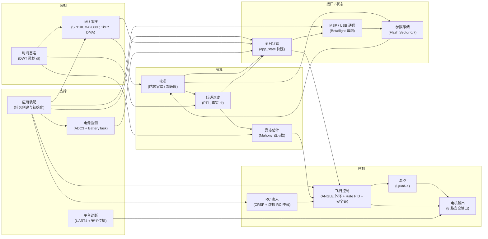
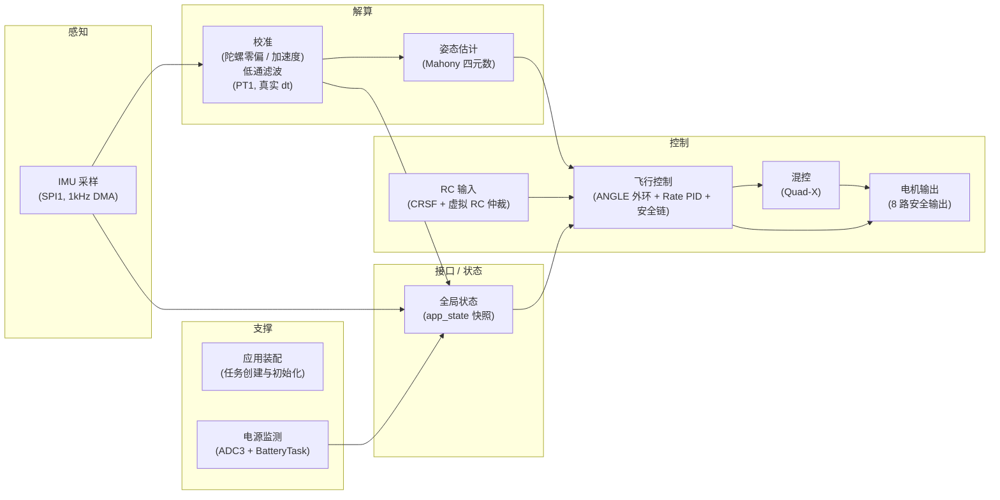

<!--
文档用途：飞控固件 APP 应用层的系统逻辑（数据流/控制流）架构图。
覆盖范围：15 个子系统及其跨模块依赖，按功能阶段分组成 5 列。
关联核心模块：APP/Src/rtos/*、APP/Src/algorithms/*、APP/Src/bsp/*、APP/Src/platform/*、APP/Src/protocol/*、APP/Src/storage/*。
渲染方式：VS Code 中打开本文件按 Ctrl+Shift+V（Markdown 预览），Mermaid 原生渲染，离线可用。
结论仍需实物验证：连线语义依据 CLAUDE.md 与源码梳理，未逐行核对运行时调用顺序。
-->

# GETFUN_F722 飞控 APP 层 — 系统逻辑管道图

按数据流/控制流从左到右分 5 个阶段：**感知 → 解算 → 控制 → 接口/状态 → 支撑**。

## 读图说明

- **实线箭头** = 数据/控制流向（谁把数据交给谁）。
- **主信号链**：`IMU采样 → 校准 → 低通滤波 → 姿态估计 → 飞行控制 → 混控 → 电机输出`，这是飞控的核心闭环。
- **时间基准**从上方贯穿采样、滤波、姿态三处，提供真实 `dt`。
- **RC 输入**在飞行控制处汇入主链（设定值来源）。
- **全局状态**是各模块发布、飞行控制与 MSP 读取的中枢；**参数存储**持久化校准零偏与配置；**诊断**在故障/保存前强制电机低电平。

## 子系统 → 源码映射

| 子系统 | 主要源文件 |
|---|---|
| 应用装配 | `APP/Src/rtos/app_task.c` |
| IMU 采样 | `APP/Src/rtos/imu_task.c`, `APP/Src/bsp/imu_bus.c`, `APP/Src/drivers/icm42688p.c` |
| 时间基准 | `APP/Src/platform/platform_time.c` |
| 校准 | `APP/Src/algorithms/gyro_calibration.c`, `APP/Src/algorithms/accel_calibration.c` |
| 低通滤波 | `APP/Src/algorithms/imu_filter.c` |
| 姿态估计 | `APP/Src/algorithms/attitude_estimator.c` |
| RC 输入 | `APP/Src/rtos/rc_task.c`, `APP/Src/bsp/crsf_uart.c`, `APP/Src/algorithms/rc_source_arbiter.c`, `APP/Src/algorithms/rc_setpoint.c` |
| 飞行控制 | `APP/Src/rtos/flight_task.c`, `APP/Src/algorithms/angle_outer_loop.c`, `APP/Src/algorithms/rate_pid.c`, `APP/Src/algorithms/flight_arming.c` |
| 混控 | `APP/Src/algorithms/quad_x_mixer.c` |
| 电机输出 | `APP/Src/bsp/dshot_motor.c` |
| MSP/USB 通信 | `APP/Src/bsp/usb_cdc_transport.c`, `APP/Src/protocol/msp_transport.c`, `APP/Src/protocol/msp_server.c` |
| 参数存储 | `APP/Src/storage/parameter_store.c` |
| 全局状态 | `APP/Src/app_state.c` |
| 平台诊断 | `APP/Src/platform/platform_diag.c` |
| 电源监测 | `APP/Src/bsp/power_adc.c`, `APP/Src/algorithms/power_monitor.c`, `APP/Src/rtos/battery_task.c` |

